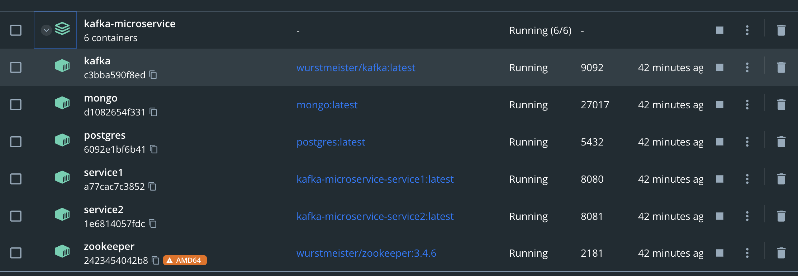
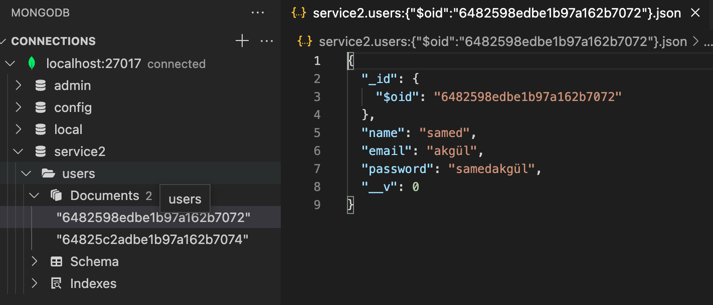
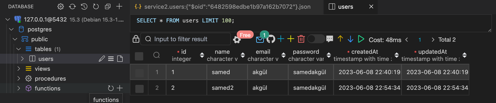

# kafka-microservice

This project is a Node.js backend project aimed at creating a microservice architecture using Node.js, Kafka, Docker Compose, MongoDB, and PostgreSQL. The project utilizes Kafka's producer and consumer roles to retrieve data from a project using MongoDB.

## Project Objectives

- Communicate with Kafka using a microservice architecture
- Perform message sending and receiving operations via Kafka
- Perform database operations using PostgreSQL
- Create a user in a project using MongoDB

### Prerequisites

Make sure the following prerequisites are met for the project to work:

- Ensure Node.js is installed on your local machine.
- Ensure Docker and Docker Compose are installed on your local machine.
- Ensure MongoDB and PostgreSQL databases are running. (These are running from Docker)

## Installation
To run this project locally, make sure you have the following software installed:

`Node.js`

`Kafka`

`Docker Compose`

`MongoDB`

`PostgreSql`

Follow the steps below to get started:

1. Clone the repo to your local machine: `git clone https://github.com/thesammet/kafka-microservice.git`
2. Navigate to the project directory: `cd kafka-microservice`
3. Install the dependencies: `npm install` or `yarn install`
4. Docker Compose up: `docker-compose up`

## Usage
Once the project is successfully running, the Kafka producer and consumer will be running on specific ports, and user creation operations will be performed by saving the data retrieved from MongoDB to the PostgreSQL database.

## VS Code Extensions
To enhance your development experience, the following VS Code extensions are recommended:

1. MongoDB for VS Code: Provides MongoDB integration within VS Code for querying and managing databases.

2. Docker: Enables seamless integration with Docker, allowing you to manage containers and images within VS Code.

3. Database Client: Offers a GUI for connecting to various databases, including MongoDB and PostgreSQL, and performing database operations.

4. Thunder Client: A REST API client that allows you to send HTTP requests and view responses directly within VS Code.

Feel free to install these extensions from the Visual Studio Code Marketplace to enhance your development environment.

## Contributing

If you would like to contribute to this project, follow these steps:

1. Fork the repo to your own GitHub account.
2. Clone the repo to your local machine.
3. Make your changes and commit them to your local branch.
4. Push your changes to your forked repo.
5. Submit a pull request to the original repo.

## License

This project is licensed under the MIT License. See the `LICENSE` file for more information.

---

This README file provides basic information on running the project and contributing to it. For more details or usage examples, please refer to the project's source code.

Happy coding!
